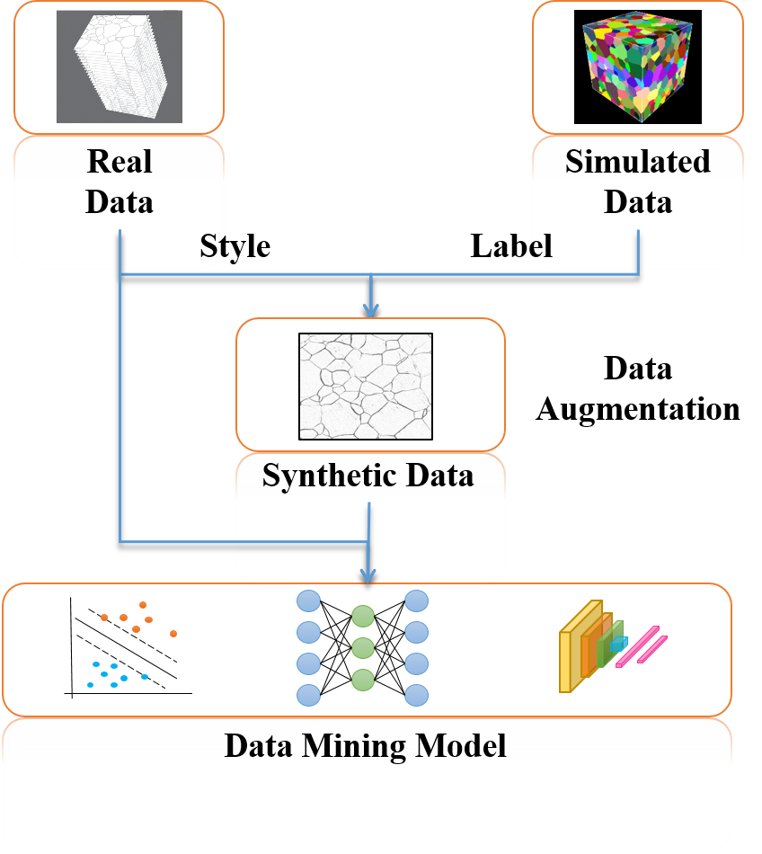

# Data augmentation in microscopic images for material data mining

<br>
We use [pix2pix](https://github.com/junyanz/pytorch-CycleGAN-and-pix2pix.git) for image style transfer as augmentation network, have trained augmentation models with different ratio of polycrystalline iron data and generated corresponding synthetic datasets in [Google Drive](https://drive.google.com/drive/folders/1gaYX4draApnFKRZi5NSA0ggbBNoMimFP?usp=sharing) or [BaiduNetdisk](https://pan.baidu.com/s/1tdCBcQprOh9gFZuuqcPcOw) (access code:rwjr).

# Get Started
## installation
Clone this repo.
```bash
git clone https://github.com/LitYan/aug_models.git
cd aug_models
```
This code requires PyTorch 1.1 and python 3+. Please install dependencies by
```bash
pip install -r requirements.txt
```
And you would need an NVIDIA machine with 4 GTX 1080Ti GPUs or 4 Telsa V100 GPUs.

## Download Datasets
We used a iron crystal dataset. We have opened up the experimental datasets as needed. Please download them on the respective webpages. we uploaded most of data in Google Drive due to the space limitation , and uploaded all the data in BaiduNetdisk.
1. [Google Drive](https://drive.google.com/drive/folders/1DSePVowja0HyDmZ9g7Xlef4VW_YGqA_u?usp=sharing)
2. [BaiduNetdisk](https://pan.baidu.com/s/1Kdi-6-lJKI3c7prLRqVYVw) (access code:5hsw)

**Preparing iron crystal Dataset**. In particular, you will need to download **real_data** folder and **synthetic_data** folder. The real images and labels have already been divided into train, val and test set. In addition，the synthctic images and labels should be placed in the train set. To do this, save them in './datasets', and run
```bash
cd datasets
mv real_data/* ./
mv synthetic_data/* ./train
for z in *.zip ./*/*.zip ./*/*/*.zip; do unzip $z -d $(dirname $z); done
rm -r real_data synthetic_data
cd ../
```
## Applying in Image segmentations

Once the dataset is ready, these synthetic data can be applied in image segmentation tasks as data augmentation for real data like we did in [examples.ipynb](./examples.ipynb).

* train, for example.
```bash
python ./scripts/train.py --net unet --train_type 'mix' --gpu_ids 0,1 \
--dataroot './datasets/' --batch_size 8 \
--train_img_dir_real 'train/real_images' \
--train_label_dir_real 'train/real_labels' \
--train_img_list_real './datasets/train/records_txt/real_5.txt' \
--train_img_dir_syn 'train/syn_images/iron_label2real_pix2pix_real_5/latest' \
--train_label_dir_syn 'train/syn_labels' \
--val_img_dir 'val/real_images' \
--val_label_dir 'val/real_labels' \
--checkpoints_dir './ckpts/seg_models' \
--name 'model_real_5_mix_syn' \
--display_env 'model_real_5_mix_syn'
```
There are many options you can specify. Please use `python train.py --help`. The specified options are printed to the console. To specify the number of GPUs to utilize, use `--gpu_ids`.If you want to use the first and second GPUs, use `--gpu_ids 0,1`.

* test
```bash
python ./scripts/test.py --net unet --name 'model_real_5_mix_syn'\
--checkpoints_dir './ckpts/seg_models/' \
--dataroot './datasets/test/' \
--test_img_dir 'real_images' \
--test_label_dir 'real_labels' \
--epoch 'epoch_4_7200' --results_dir './results/' --gpu_ids 0
```
Use `--results_dir` to specify the output directory. `--epoch` will specify the checkpoint to load.

* Our pretrained models

Download the pth files of pretrained models from the [Google Drive](https://drive.google.com/drive/folders/1ZGARJIMT3nUw5pzw0ztD8Ql5OwS9aCW0?usp=sharing) or [BaiduNetdisk](https://pan.baidu.com/s/12I5YETYNTLCuhGsGR4205w)(access code:8mg7), save them in './ckpts/seg_models', and run
```bash
python ./scripts/test.py --net unet --name 'model_real_5_mix_syn'\
--checkpoints_dir './ckpts/seg_models/' \
--dataroot './datasets/test/' \
--test_img_dir 'real_images' \
--test_label_dir 'real_labels' \
--epoch 'epoch_4_7200' --results_dir './results/' --gpu_ids 0
```
***
## How to generate a synthetic dataset 
* Generating images Using Pretrained Models

The synthetic images can be generated using pretrained models.
Download the pth files of pretrained models from the [Google Drive](https://drive.google.com/drive/folders/152csoud9uHsxXEQNosucTPiWopFFAIFw?usp=sharing) or [BaiduNetdisk](https://pan.baidu.com/s/1jlx0aKRe4WA7JkbnQ8TMNg)(access code:m425), save them in './ckpts/aug_models', and run
```bash
python ./scripts/generate_samples.py  --name iron_label2real_pix2pix_real_5  --num_test 28800 \
--gpu_ids 0 --batch_size 1 --checkpoints_dir './ckpts/aug_models/' \
--dataroot './datasets/' --phase 'train' --label_dir 'syn_labels' \
--results_dir './datasets/train/syn_images'  --epoch 'latest'
```
* training new models, for example.
```bash
python ./scripts/train_pix2pix.py   --name iron_label2real_pix2pix_real_5 \
--gpu_ids 0,1 --batch_size 8 --checkpoints_dir './ckpts/aug_models' \
--dataroot './datasets/' --phase 'train' --label_dir 'real_labels' --image_dir 'real_images' \
--record_txt './datasets/train/records_txt/real_5.txt' \
--display_env 'real_5'
```
# Code Structure
- `scripts/train.py`, `scripts/test.py`: the entry point of training and testing for image segmentation.
- `scripts/train_pix2pix.py`, `scripts/generate_samples.py`: the entry point of training and testing for image style transfer.
- `scripts/check_paired_dataset.py`: check dataset and plot paired images and labels.
- `scripts/auto_segmentations.py`: The commonly used auto image segmentations by threshold, morphology or edge detection.
- `models/pix2pix_model.py`: creates the augmentation networks.
- `models/unet_model.py`: creates the segmentation networks.
- `models/networks/`: defines the architecture of all models.
- `options/`: creates option lists using `argparse` package.
- `data/`: defines the class for loading images and label maps.

This code structure borrows heavily from [pytorch-CycleGAN-and-pix2pix](https://github.com/junyanz/pytorch-CycleGAN-and-pix2pix.git)

# Citation
If you use it successfully for your research please be so kind to cite the [paper](https://www.nature.com/articles/s41524-020-00392-6#citeas).

Ma, B., Wei, X., Liu, C. et al. Data augmentation in microscopic images for material data mining. npj Comput Mater 6, 125 (2020). https://doi.org/10.1038/s41524-020-00392-6

# Acknowledgement
The authors acknowledge the financial support from the National Key Research and Development Program of China (No. 2016YFB0700500).
